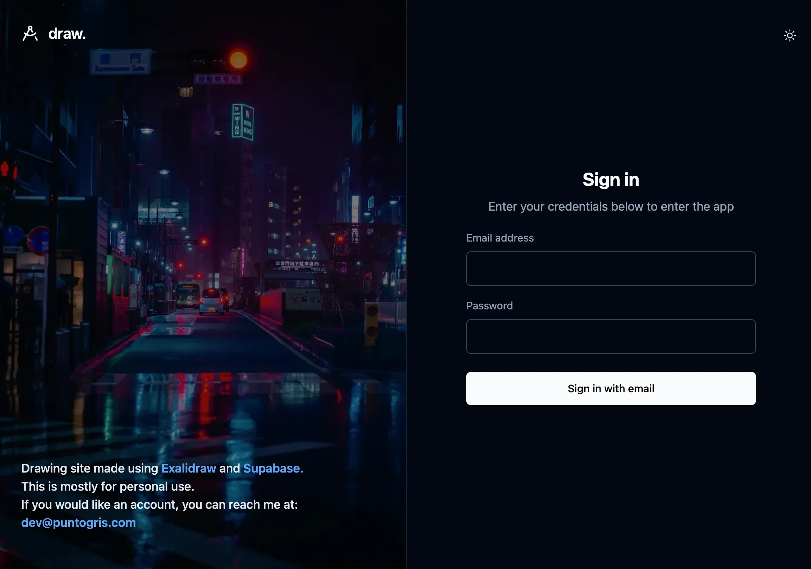
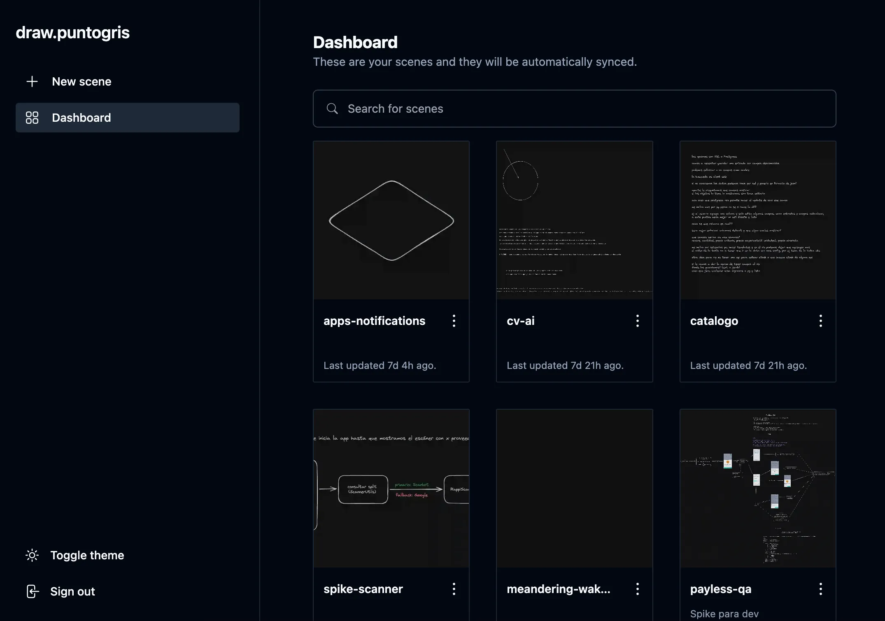
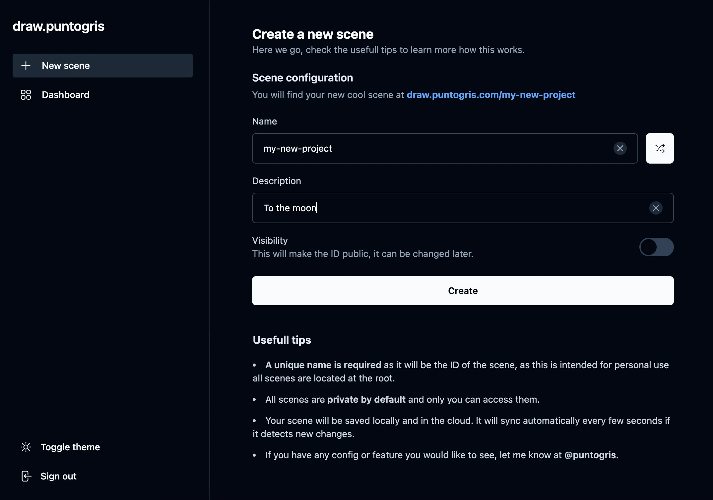
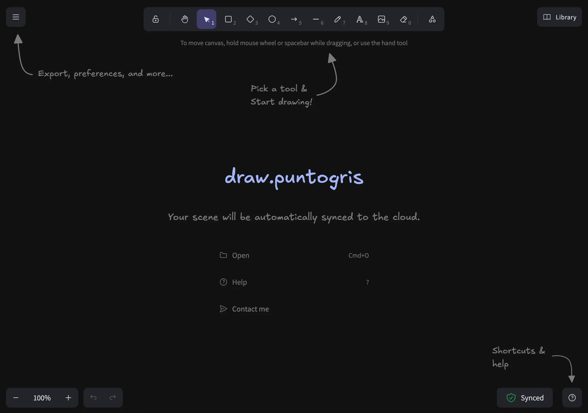

# .draw

Drawing site made for personal use.

## Self-Hosting & Deployment

If you'd like to self-host this project, you'll need a [Supabase](https://supabase.com) account to manage authentication, database, and storage.

**Required Environment Variables:**

- `SUPABASE_URL`
- `SUPABASE_ANON_KEY`

For deployment, the choice is yours! Services like [Vercel](https://vercel.com) make it incredibly simple: just link your GitHub repository and deploy.

## Made with:

- Exalidraw
- Supabase
- React Router
- Tailwind CSS

## TODO:

- Colaboration mode

## Screenshots

### Home page

### Dashboard

### Create a new scene

### Draw

