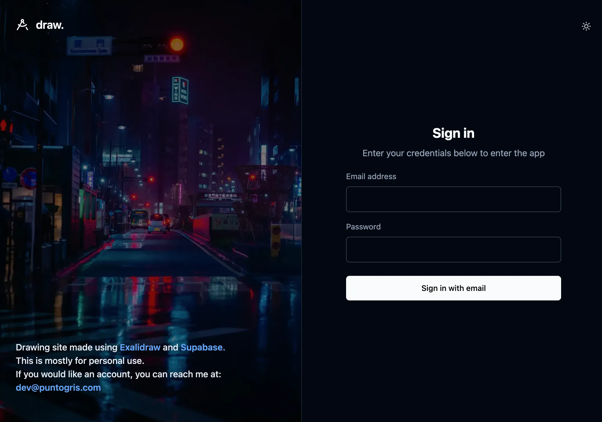
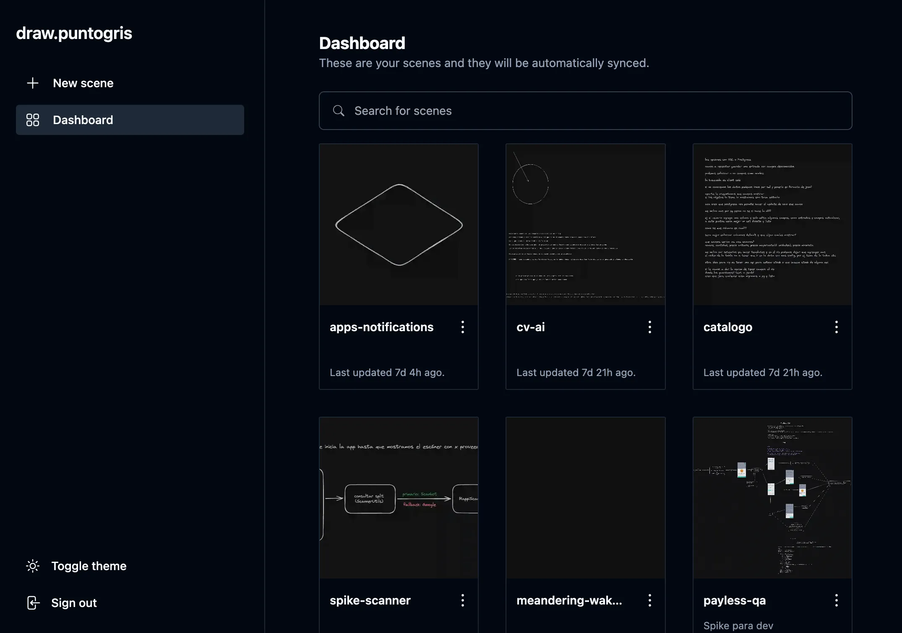
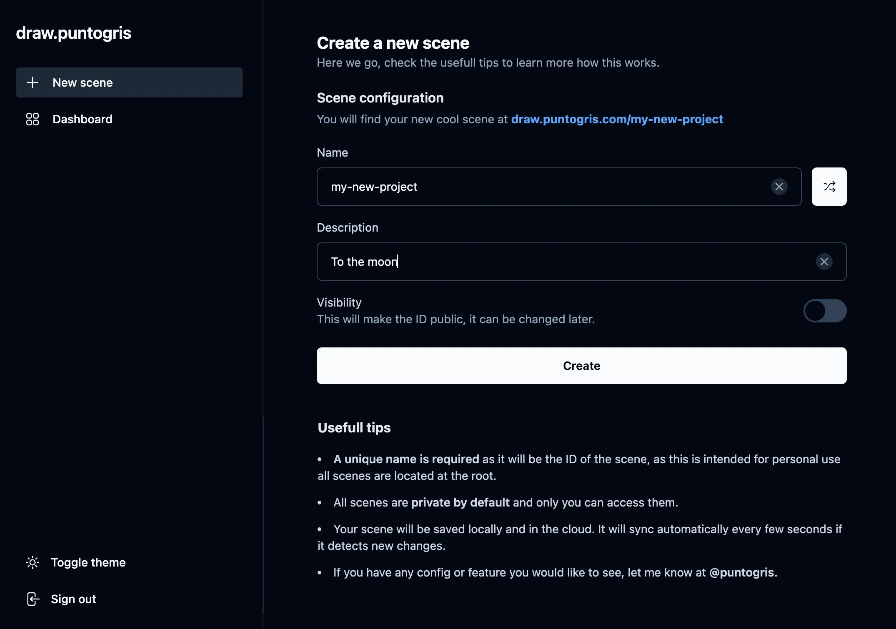
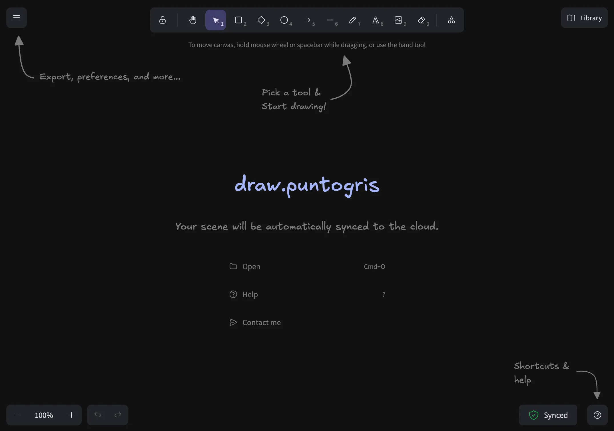

# .draw

Drawing site made for personal use.

## Self-Hosting & Deployment

Create a [Convex](https://convex.dev) project, then run `bunx convex dev` to configure a development deployment and generate backend types.

**Required Environment Variables:**

- `CONVEX_DEPLOYMENT`
- `CONVEX_URL`

Convex Auth also needs `JWT_PRIVATE_KEY` and `JWKS` in the deployment environment. Run `bunx @convex-dev/auth` after linking the project to generate them.

For deployment, the choice is yours! Services like [Vercel](https://vercel.com) make it incredibly simple: just link your GitHub repository and deploy.

## Made with:

- Exalidraw
- Convex
- React Router
- Tailwind CSS

## TODO:

- Colaboration mode

## Screenshots

### Home page

### Dashboard

### Create a new scene

### Draw

